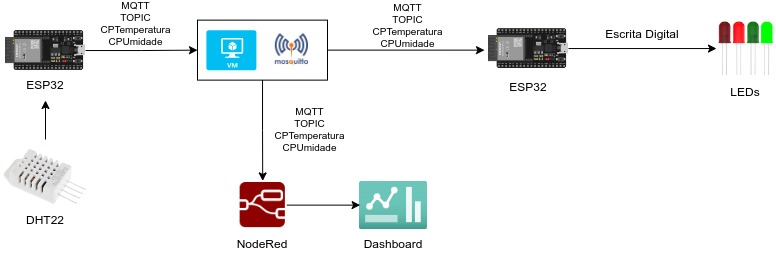

# Disruptive Architectures - IoT - Checkpoint 02

## Sumário
- [Integrantes;](#integrantes)
- [Arquitetura da solução;](#arquitetura-da-solução)
- [Vídeo da solução;](#vídeo-da-solução)
- [Broker personalizado;](#broker-personalizado)
- [Configurações da aplicação;](#configurações-da-aplicação)
- [Link das placas.](#link-das-placas)

## Integrantes
- Beatriz Lucas - RM99104;
- Enzo Farias - RM98792;
- Ewerton Gonçalves - RM98571;
- Gabriel Augusto Fernandes - RM98986;
- Guilherme Tantulli - RM97890;
- Kauê Fernandes Braz - RM97768;
- Mariana Trentino Albano - RM551154;
- Matheus Dantas de Sousa - RM98406;
- Thiago Zupelli - RM99085;
- Thomas Nícolas de Melo Mendonça - RM99832.

## Arquitetura da solução

## Vídeo da solução

## Broker personalizado
O Mosquitto é um broker de mensagens leve e de código aberto que implementa o protocolo MQTT, usado principalmente em Internet das Coisas (IoT). Ele facilita a comunicação entre dispositivos, permitindo que publiquem e assinem mensagens em um sistema de publicação/assinatura. O MQTT é ideal para dispositivos com baixo consumo de energia e redes de baixa largura de banda. O Mosquitto é escalável e eficiente, sendo usado em projetos de automação, monitoramento e redes IoT.\
\
Imagem da VM do Broker:

### Instalando MQTT — Broker (Mosquitto):
O primeiro passo é a atualização dos pacotes do Linux (Ubuntu / Debian):\
**`sudo apt-get update`**\
**`sudo apt-get upgrade`**\
ou \
**`sudo apt-get update -y && sudo apt-get upgrade -y`**\
\
Em seguida, é necessário fazer a instalação do software mosquitto:\
**`sudo apt-get install mosquitto`**\
**`sudo apt-get install mosquitto-clients`**\
\
Após isso, basta restartar o mosquitto:\
**`sudo systemctl restart mosquitto`**

## Configurações da aplicação
As placas ESP32 estão sendo utilizadas pelo Wokwi. Dessa maneira, a configuração de conexão com a internet é feita com o seguinte código:\
**`const char* ssid = "Wokwi-GUEST";`**\
**`const char* password = "";`**\
\
Dessa forma, as placas (tanto a publisher como a subscriber) se conectam com a internet por meio do servidor do Wokwi. Em seguida, são inscritas
nos tópicos "CPTemperatura" e "CPUmidade", de modo a enviar os dados simulados pelo DHT22 na publisher e a serem recebidos pela subscriber. Além disso, 
o servidor do NODE-RED também está conectado aos mesmos topics, recebendo as mesmas informações e criando dashboards para a representação tanto da
alteração em gráfico de linha, como a representação em um "gauge", mostrando e definindo os valores. Essa configuração é feita a partir do seguinte código:\
\
(Conexão com o servidor do Mosquitto pela VM criada na Azure)\
**`const char* mqtt_server = "191.234.211.26";`**\
(Inscrição no tópico "CPTemperatura")\
**`const char* mqtt_topic_temperatura = "CPTemperatura";`**\
(Inscrição no tópico "CPUmidade")\
**`const char* mqtt_topic_umidade = "CPUmidade";`**\
\
A conexão com o servidor acontece com a configuação **`client.setServer(mqtt_server, 1883);`**, onde indicamos o servidor do Broker e a porta utilizada. Assim, as placas estão configuradas para a conexão com a internet e o compartilhamento de informações pelo servidor. A partir desse ponto, ocorre a configuração na publisher do que enviar e para qual topic enviar, assim como na subscriber ocorre a configuração do mesmo servidor para o recebimento das informações e a resposta pelas cores dos LEDs de acordo com as circunstâncias dos dados coletados:
- LED Verde: Dados de temperatura acima de 20ºC e umidade acima de 50%;
- LED Azul: Dados de temperatura abaixo de 20ºC e umidade acima de 50%;
- LED Amarelo: Dados de temperatura acima de 20ºC e umidade abaixo de 50%;
- LED Vermelho: Dados de temperatura abaixo de 20ºC e umidade abaixo de 50%.

Dessa forma, as placas conversam entre si, enviando e consumindo informações de temperatura e umidade, respondendo pelos LEDs a situação em que se encontra o DHT22 e criando Dashboards no NODE-RED.

## Link das placas
Publisher: https://wokwi.com/projects/412361981336209409 \
Subscriber: https://wokwi.com/projects/412362046757935105